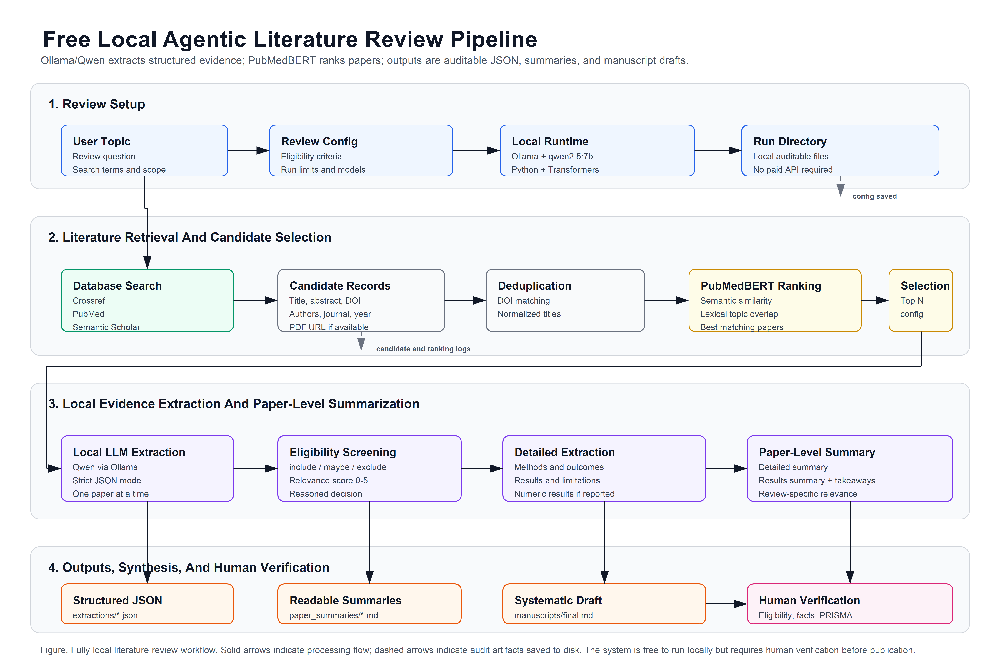

# Local Literature Review Agent

A free, local-first agentic pipeline for literature search, paper ranking, structured information extraction, paper-level summarization, and systematic-review manuscript drafting.

This project uses:

- **Ollama + Qwen** for local LLM extraction and drafting.
- **PubMedBERT** for biomedical/scientific relevance ranking.
- **Crossref, PubMed, and Semantic Scholar** for literature search.
- Local JSON and Markdown outputs for transparent human review.

No Claude, OpenAI, Gemini, or paid LLM API is required.



## What The Pipeline Does

1. Takes a topic, review question, search terms, and eligibility criteria from a JSON config.
2. Searches literature databases.
3. Deduplicates records by DOI or normalized title.
4. Ranks candidate papers using PubMedBERT plus lexical topic overlap.
5. Sends top-ranked papers to a local Qwen model through Ollama.
6. Screens papers as `include`, `maybe`, or `exclude`.
7. Extracts structured systematic-review information into JSON.
8. Writes detailed paper-level Markdown summaries.
9. Drafts a PRISMA-style systematic-review manuscript from included papers.

## Hardware Guidance

Recommended starting point:

- 16 GB RAM or more
- 10 GB free disk space for Ollama model storage
- Python 3.10+
- CPU-only is supported, but slow

Recommended local model for typical laptops:

```text
qwen2.5:7b
```

Avoid 32B or 70B models unless you have a high-memory workstation or strong GPU. A 14B model may improve quality, but it is much slower and may be memory-heavy on 16 GB RAM machines.

## Installation

### 1. Clone Or Download This Repository

```powershell
git clone https://github.com/YOUR-USERNAME/local-literature-review-agent.git
cd local-literature-review-agent
```

If you downloaded a ZIP from GitHub, unzip it and open PowerShell in the project folder.

### 2. Install Ollama

Download and install Ollama:

<https://ollama.com/download>

Restart PowerShell after installation.

Pull the recommended free local model:

```powershell
ollama pull qwen2.5:7b
```

Optional Ollama test:

```powershell
ollama run qwen2.5:7b "Return JSON with status ok."
```

### 3. Create Python Environment

Windows PowerShell:

```powershell
py -3.10 -m venv .venv
.\.venv\Scripts\python.exe -m pip install --upgrade pip
.\.venv\Scripts\python.exe -m pip install -r requirements.txt
```

If PowerShell blocks virtual-environment activation, you do not need activation. Use:

```powershell
.\.venv\Scripts\python.exe run_review.py --config config.quick.json
```

Optional activation for the current PowerShell window only:

```powershell
Set-ExecutionPolicy -Scope Process -ExecutionPolicy Bypass
.\.venv\Scripts\Activate.ps1
```

macOS/Linux:

```bash
python3.10 -m venv .venv
source .venv/bin/activate
python -m pip install --upgrade pip
pip install -r requirements.txt
```

### 4. Optional Environment File

Copy the example:

```powershell
Copy-Item .env.example .env
```

Optional settings:

```text
SEMANTIC_SCHOLAR_API_KEY=
NCBI_EMAIL=
OLLAMA_BASE_URL=http://127.0.0.1:11434
```

The pipeline works without these values at low volume, but public APIs may rate-limit more often without optional keys/contact email.

## Verify Setup

Run:

```powershell
.\.venv\Scripts\python.exe scripts\check_setup.py
```

This checks:

- Python dependencies
- Ollama server availability
- Installed Ollama model
- PubMedBERT loading
- Project config parsing

## Quick Test Run

Use the small smoke-test config:

```powershell
.\.venv\Scripts\python.exe run_review.py --config config.quick.json
```

`config.quick.json` intentionally extracts only one paper so users can confirm the pipeline works.

## Full Example Run

Use:

```powershell
.\.venv\Scripts\python.exe run_review.py --config config.example.json
```

The default example can extract up to 30 ranked papers. On CPU-only laptops, this may take hours.

For a more detailed but still laptop-friendly run, use:

```powershell
.\.venv\Scripts\python.exe run_review.py --config config.detailed.json
```

`config.detailed.json` uses more specific extraction instructions and custom extraction questions. It also avoids Semantic Scholar by default because that API often rate-limits unauthenticated users.

## Generate Only The Manuscript

If you already completed a literature search and extraction run, you can regenerate only the manuscript without repeating search, ranking, or extraction.

Use the newest run folder:

```powershell
.\.venv\Scripts\python.exe generate_manuscript.py --latest --config config.detailed.json
```

Or use a specific previous run folder:

```powershell
.\.venv\Scripts\python.exe generate_manuscript.py --run-dir "D:\Literature_Search\runs\YOUR_RUN_FOLDER_NAME" --config config.detailed.json
```

The manuscript will be saved to:

```text
runs/YOUR_RUN_FOLDER_NAME/manuscripts/manuscript_final.md
```

This manuscript-only command reads the existing `extractions/*.json` files, keeps only studies marked `include` with a relevance score at or above `min_relevance_score`, and asks the local Qwen model to draft the manuscript. If the local model fails to produce valid structured output, the script still saves a fallback evidence-based manuscript draft instead of leaving the `manuscripts/` folder empty.

## Configure Your Own Review

Copy the example config:

```powershell
Copy-Item config.example.json my_review.json
```

Edit:

- `topic`
- `review_question`
- `search_terms`
- `inclusion_criteria`
- `exclusion_criteria`
- `max_results_per_source`
- `max_papers_to_extract`
- `max_ranked_candidates`

Important local-model settings:

```json
{
  "llm_provider": "ollama",
  "extract_model": "qwen2.5:7b",
  "draft_model": "qwen2.5:7b",
  "use_pubmedbert_ranking": true,
  "max_papers_to_extract": 30,
  "max_ranked_candidates": 30,
  "draft_during_extraction": false,
  "draft_manuscript": true,
  "concurrency": 1
}
```

Keep `concurrency` at `1` for CPU-only machines.

## Outputs

Each run creates:

```text
runs/YYYYMMDD-HHMMSS-topic-slug/
  review_config.json
  run_stats.json
  ranked_candidates.json
  candidates/
  extractions/
  paper_summaries/
  logs/
  manuscripts/
```

Important files:

- `ranked_candidates.json`: all deduplicated candidates ranked by relevance.
- `extractions/*.json`: structured extraction for each processed paper.
- `paper_summaries/*.md`: readable paper-level summaries.
- `manuscripts/manuscript_final.md`: PRISMA-style manuscript draft, when included papers are found.
- `logs/errors.jsonl`: failed searches or extraction errors.

## Accuracy And Human Review

This is a free local assistant, not a replacement for a human systematic-review team.

Always verify:

- Eligibility decisions
- Extracted study methods
- Numeric results
- Risk-of-bias notes
- Claims in the generated manuscript
- PRISMA checklist compliance

For publication-grade work, use this pipeline as a first-pass assistant and manually confirm every extracted field against the paper.

## Troubleshooting

### Ollama Is Not Reachable

Start Ollama or run:

```powershell
ollama serve
```

### Model Not Found

Run:

```powershell
ollama pull qwen2.5:7b
```

### Run Is Too Slow

Reduce:

```json
{
  "max_papers_to_extract": 5,
  "max_ranked_candidates": 5
}
```

### PubMedBERT Downloads Slowly

The first run downloads PubMedBERT from Hugging Face:

```text
microsoft/BiomedNLP-PubMedBERT-base-uncased-abstract-fulltext
```

After the first successful download, it is cached locally.

## Repository Safety

Do not commit:

- `.env`
- `.venv/`
- `runs/`
- local cache files

These are already ignored by `.gitignore`.

## License

MIT License. See [LICENSE](LICENSE).
